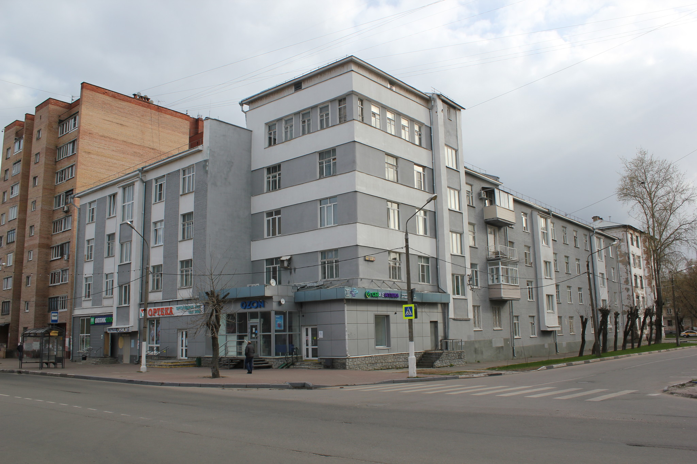

**Пояснительная записка к школьному проекту "Тепловая карта многоквартирных домов г. Орехово-Зуево" Московской области**

**Введение**

Идея моего проекта возникла однажды во время прогулки по Орехово-Зуево – уютному городу с богатой историей и разнообразной архитектурой. Передо мной открывалась картина контрастов: старые, исторические здания соседствовали с новыми, современными многоквартирными домами. Это заставило меня задуматься о том, как именно возраст и архитектурные особенности зданий влияют на жизнь города и его облик.

**Исторический и экономический контекст Орехово-Зуево**

Орехово-Зуево, расположенное в Московской области, обладает уникальной историей и экономикой. Город известен своими текстильными фабриками, которые в прошлом веке были основой экономики. В архитектурном плане Орехово-Зуево представляет собой сочетание исторических зданий начала XX века и современных жилых комплексов. Этот контраст создает уникальную атмосферу и делает город интересным объектом для изучения.

### 19 век: Начало всего

В 19 веке Орехово-Зуево стало знаменитым благодаря своим текстильным фабрикам. Город рос вокруг этих фабрик, и рабочим нужны были дома поближе к работе. Поэтому начали строить деревянные и кирпичные домики, небольшие, но уютные, чтобы рабочие и их семьи могли жить рядом с фабриками.

### Начало 20 века: Железные дороги меняют игру

Когда появились железные дороги, город взял курс на рост. Это был настоящий прорыв: товары теперь можно было быстро отправлять в другие города, и это привлекало всё больше людей. В ответ на это начали строить больше домов, уже не только для рабочих фабрик, но и для всех, кто приезжал в Орехово-Зуево в поисках работы и лучшей жизни.

### Советский период: Все вместе

С приходом советской власти всё изменилось. Теперь главная задача была построить как можно больше жилья для всех. В городе начали расти целые районы с типовыми многоквартирными домами. Эти дома были простыми, но в них было всё необходимое для жизни: центральное отопление, вода, свет. Вокруг домов обустраивались парки, школы, магазины – всё, чтобы жителям было удобно и комфортно.

### Постсоветское время: Новая волна

После распада СССР город продолжил расти, но теперь уже по-новому. Строительство стало делом частных компаний, и в городе стали появляться жилые комплексы современного типа. Эти дома отличались крутым дизайном и улучшенной планировкой квартир. Город стал привлекательным не только для рабочих, но и для тех, кто искал удобное и современное жильё.

**Сбор данных о годе постройки домов**

Для реализации проекта необходимо было собрать данные о многоквартирных домах города, в частности, год их постройки. Эту информацию я получила с сайта dom.mingkh.ru, использовав парсер, написанный на языке программирования Python. Также пришлось написать скрипт для преобразования границ объектов из формата OSM (формат объектов OpenStreetMaps) в формат geoJson. Этап сбора данных требовал внимательности и технических знаний, но благодаря полученным данным я смогла перейти к следующему этапу проекта.

**Визуализация данных с помощью D3 и Leaflet**

Для отрисовки тепловой карты многоквартирных домов я использовала JavaScript фреймворки D3 и Leaflet. D3 позволил мне создать визуализацию, где каждый дом представлен отдельной точкой, цвет которой зависит от возраста здания. Leaflet же использовался для добавления карты и слоев, что сделало проект наглядным и понятным и позволило отобразить на карте преимущественный возраст застройки района города. Работа с этими инструментами требовала тщательного планирования и разработки, но в результате я смогла визуально продемонстрировать, как исторический контекст и возраст зданий влияют на городскую среду, а также убедилась, что выбранные фреймворки позволяют быстро отрисовывать любую интерактивную графику и привязывать ее к карте.
Также реализовала кастомный control LeafLet, который состоит из checkbox и inputbox с кнопкой, которые реализуют функционал включения/выключения точек, соответствующих домам и поиска дома по его адресу. Для поиска адреса используется библиотека fuse.js которая реализует нечеткий поиск (fuzzy search) на массиве объектов по одному или нескольким атрибутам.

**Демонстрация проекта**
На карте можно увидеть сохранившиеся области жилой застройки 19в, которые представляли собой дома, построенные известными предпринимателями Морововыми и Зимиными для рабочих, занятых на их текстильных производствах (показать). 
Более молодая застройка начала 20в соответсвует району станции Крутое, в котором фабриканты Морозовы строили дома для приехавших налаживать текстильное производство английских мастеровых.  (показать)
Застройка конца 20х и 30х годов в стиле конструктивизм - можно отметить дом по адресу Кооперативная д.1  (показать)
.
Более молодые дома 50-60х годов 20в - это хрущевки, массово построенные в разных районах города  (показать)
Дома постройки 70х-80х годов 20в можно считать почти современными, хотя их возраст часто превышает 50 лет  (показать)
Дома 90х 20в и начала 2000х - их строительство возможно видел мой старший брат :))  (показать)
Современные жилые дома, построенные совсем недавно - в 10х-20х годах нашего столетия - отличаются точечной застройкой, относительной многоэтажностью, удобной свободной планировкой помещений.   (показать)
 

**Заключение**

Проект "Тепловая карта многоквартирных домов г. Орехово-Зуево" Московской области стал для меня не только способом исследовать историю и архитектуру своего города, но и возможностью прикоснуться к миру программирования и визуализации данных. Через этот проект я увидела, как технологии могут помочь нам лучше понять и оценить окружающую среду, а также выразить нашу связь с историей и культурой места, в котором мы живем.

В ходе работы над проектом я столкнулась с различными вызовами, включая технические аспекты сбора и обработки данных, а также нюансы визуализации информации. Однако, преодолевая эти сложности, я приобрела ценный опыт и знания, которые, безусловно, пригодятся мне в будущем.

Мой проект подчеркивает значимость исторического наследия и современных разработок в формировании лица города. Я надеюсь, что он вдохновит других учащихся на собственные исследования и проекты, направленные на изучение и улучшение нашего общего пространства.

В заключение хочется выразить благодарность всем, кто поддерживал меня в реализации этого проекта: учителям, родителям и друзьям. Ваша помощь и ободрение были неоценимы на каждом этапе моей работы. Этот работа стала для меня не просто учебным проектом, а путешествием в историю моего города и открытием новых горизонтов в области IT и открытых данных.

**Ресурсы**

https://dom.mingkh.ru/ - общественный онлайн проект, который содержит информацию о жилом фонде РФ
https://www.openstreetmap.org - Онлайн карты, на которых размечены географические объекты
https://polygons.openstreetmap.fr/ - онлайн ресурс, который генерирует geojson по Id ресурса OpenStreetMaps
https://d3js.org - ресурс фреймворка визуализации данных D3
https://leafletjs.com - ресурс фреймворка интерактивных карт LeafLet
https://github.com/Leaflet/Leaflet.heat - библиотека для визуализации тепловых карт leaflet-heat.js 